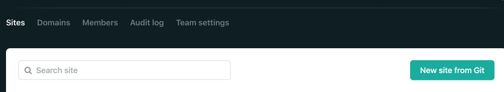
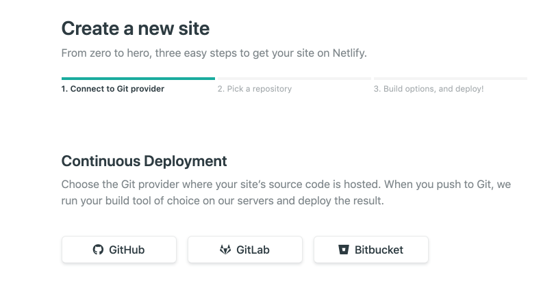
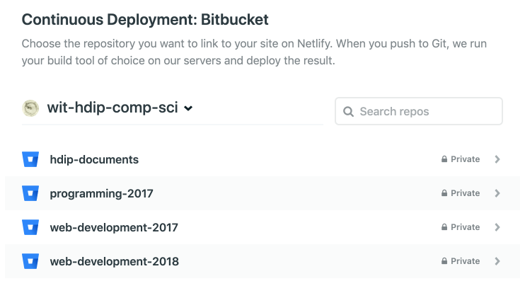
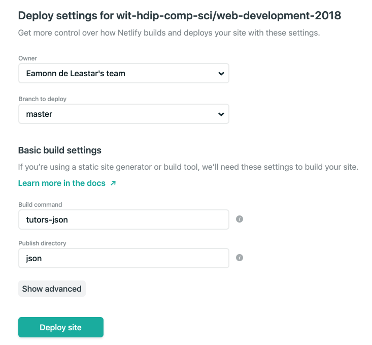
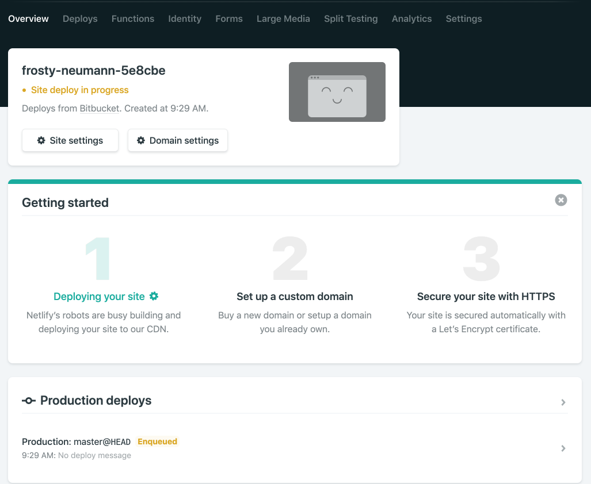
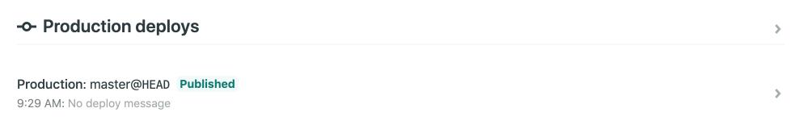
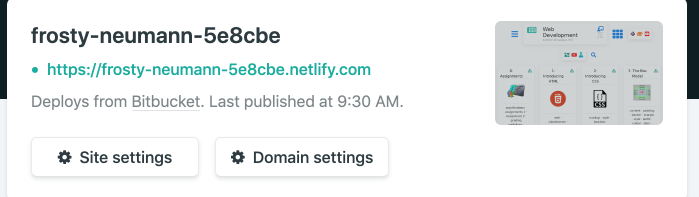
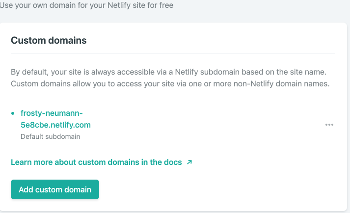
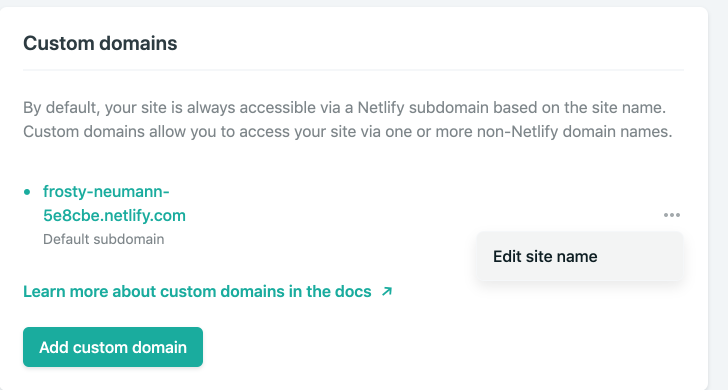
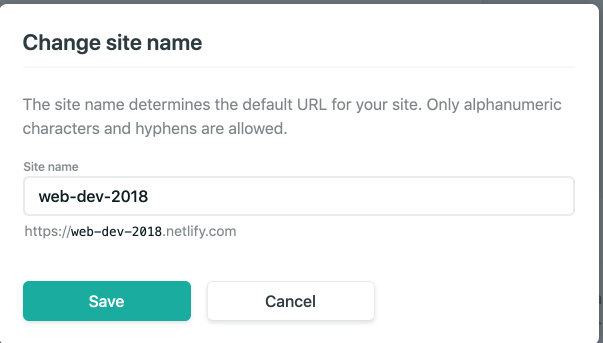

# Publication

Publication is significantly simplified. Currently your course 'source' may be hosted in Github or Bitbucket. Make sure the course has the additional files outlined in the last step - and that the additional files have been pushed to your Github or Bitbucket source repository.

Now, create a new account on this service here:

- <https://netlify.com>

You might use tour Github id to authenticate. Once logged in, press 'New Site from Git':

You will be asked to locate and select your course source web:

There will be additional authorization steps here to connect to your Github or Bitbucket account. Then, select your repository:

In the form, enter the values shown below for 'Build command' and 'Publish directory':

- Build command: `tutors-json`
- Publish directory: `json`

Then press 'Deploy Site'

This will trigger a build - on Netlify servers - of the course.

If successful, then the status screen should switch to 'Published'. If all went well, the course should be published on the generated url:

This should take less than a minute, and shorter for subsequent updates.

You can modify the domain name to something more meaningful:

The deploy procedure above will be triggered every time you push an update to your Github/Bitbucket source repo - you do not need to visit Netlify to trigger this process.