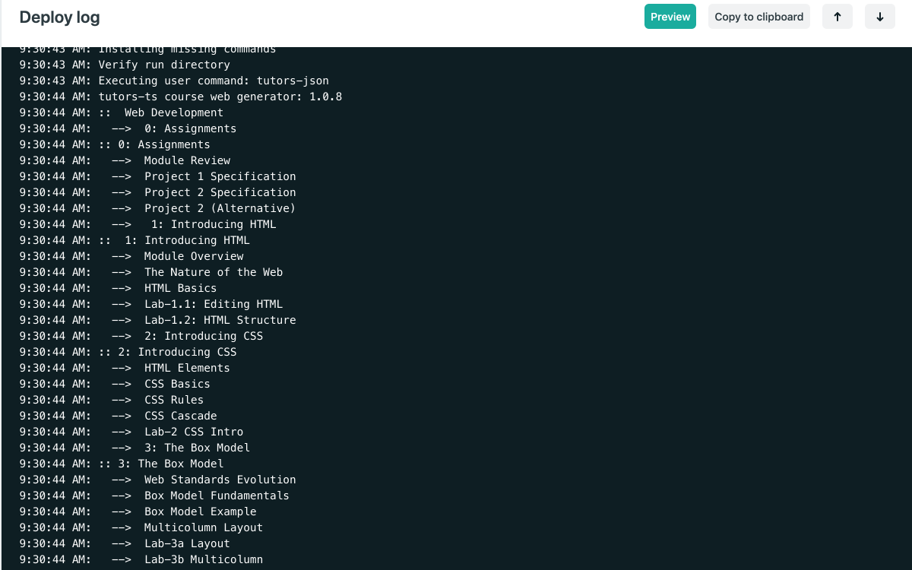

# Troubleshooting

As the build is performed on the Netlify service, you will have to inspect the logs there to see any possible errors from the course generator. In general, the errors will also have been picked up from `tutors-ts` if run locally (which will still generate a local version in public-site-uk).

The logs on Netlify can be inspected from the Deploys log:

This is the same output that you might recall from tutors-ts.

If you would like to run exactly the same generator locally, then install `tutors-json`:

~~~bash
npm install tutors-json -g
~~~

.. and then run the command:

~~~bash
tutors-json
~~~

This will print the build log locally, and generate the course to the `json` folder. If you are trying out this, be sure to put the following entry in your `.gitignore` file:

## .gitignore

~~~
json
~~~

... to avoid any upload of this to yous source repo.