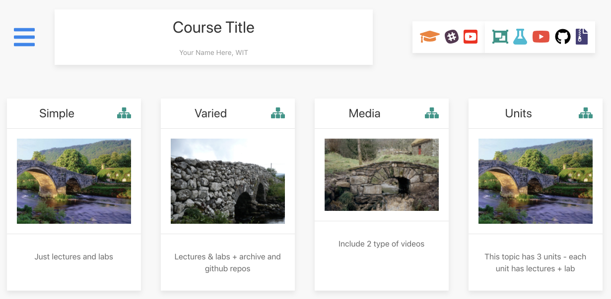

# Generate a Course

The simplest way to get started with tutors is to use the `new` command to generate a template course:

~~~
tutors-ts --new
~~~

This should respond with:

~~~
Creating new template course...
Cloning into 'tutors-starter-0'...
Next steps...
cd into tutors-starter-0 and run "tutors" again
This will generate the course web in "tutors-starter/public-site"
~~~

The command will have generated a new folder: `tutors-starter-0`, populated with a sample/template course:

Before looking at the structure of the course in detail - lets "build" the course first and look at the output from a student perspective.

Open a shell, and make sure the current directory is `tutors-starter-0`:

Then enter the `tutors-ts` command:

~~~
tutors-ts
~~~

This will respond with:

~~~
tutors-ts course web generator: 2.5.0
::   Course Title
  -->   Simple
::  Simple
  -->  Lecture 1
  -->  Lecture 2
  -->  Lab-01
  -->   Varied
::  Varied
  -->  Lecture 3
  -->  Lecture 4
  -->  Lab-02
  -->  Lab-02
  -->  Resource I
  -->  Github Repo  1
  -->  Github Repo  2
  -->   Media
::  Media
  -->  Lecture 5
  -->  Lab-04
  -->  12: Deployment
  -->  Resource I
  -->   Units
::  Units
  -->  Unit 1 Title
:: Unit 1 Title
  -->  Lecture 6
  -->  Lecture 7
  -->  Lab-05
  -->  Unit 2 Title
:: Unit 2 Title
  -->  Lecture 8
  -->  Lecture 9
  -->  Lab-06
  -->  Unit 3 Title
:: Unit 3 Title
  -->  Lecture 10
  -->  Lecture 11
  -->  Lab-07
~~~

Tutors has now generated a complete web site from the course materials. This is populated into a `public-site-uk` folder

Opening `public-site-uk/index.html` in any browser and we see the students view of the course. It should look like this:

A version is hosted here -

- <https://wit-tutors.github.io/tutors-starter-public>

Take some time to visit all of the different resources on the site - including the toolbar along the top. See if you can relate them to the folder/file structure as laid out in tutors-starter-0 folder.

