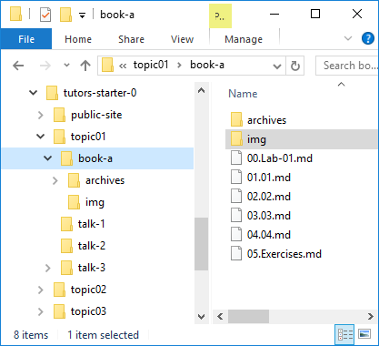

# Images

In Tutors, all images you wish to use must first be placed in the `img` folder in the current lab:

The image can then be included in markdown using this syntax:

~~~

~~~

If you wish to have a title, you can insert it between the `[]` as in:

~~~

~~~

The is the above image with a title:

Try this now:

- Locate an image using google image search 
- Incorporate into one of the lab steps
- Regenerate the course using `tutors` command
- Verify the image shows up in the content.

On most systems now you can just drag and drop from the browser directly into a folder open in Explorer (or Finder).