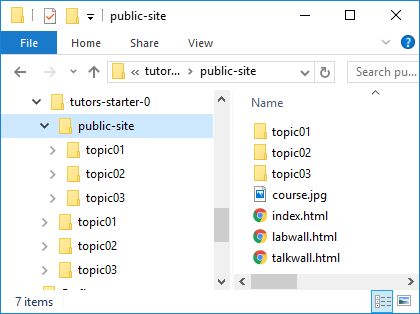

# Github Gh-pages

Github provides a convenient, free and rapid static public web site publishing facility called Gh-Pages

- <https://pages.github.com/>

This step assumes you have a github account, and git has been installed in your workstation.

Recall that tutors generates a static web site to the `./public-site` folder:

This folder is what we need to publish - not the 'source' for the course web. 
To publish a course web requires these steps: 

- determine the course web url
- Create the repository locally
- Commit all relevant files to the local repo
- Synchronise the repository with github

We will go through these steps now...

First, the course url. If we are going to publish the course on github, we will ultimately be using 2 urls.

- URL 1: The github.com reference to the repository containing the publick-site-uk folder
- URL 2: The published url of the course, which is the link you give to students.

## URL 1: github repo

This is easy to work out. You give the repo a name  - say `tutors-course-public` - and when you create and push the repo to github, this url will be:

- https://github.com/[YOUR-GITHUB-NAME]/[YOUR-REPO-NAME]

## URL 2: gh-pages repo

Again fairly easy to work out. When the site is available publicly, the url will be structured like this:

- https://[YOUR-GITHUB-NAME].github.io/[YOUR-REPO-NAME]

For this lab, the 2 urls will be:

- https://github.com/[YOUR-GITHUB-NAME]/tutors-course-public
- https://[YOUR-GITHUB-NAME].github.io/tutors-course-public

Here are examples of what to expect:

- https://github.com/edeleastar/tutors-course-public
- https://edeleastar.github.io/tutors-course-public

Work out both repo names now - and you will need to put the gh-pages url into the properties.yaml file in your course:

## properties.yaml

~~~
slack          : https://tutors-ts-group.slack.com/messages/CCKS0HR0Q
moodle         : https://moodle.wit.ie/course/view.php?id=118143&section=3
youtube        : https://www.youtube.com/playlist?list=PLMW4bgOfD3Dwi6FWirJ3AQtXZ-N_hV3Eo
highlightstyle : railscasts
courseurl      : https://wit-tutors.github.io/tutors-starter-public/
credits        : Your name, WIT
~~~

Change the courseurl property to the gh-pages url now.