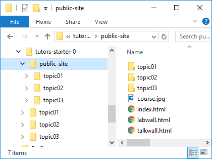

# Create a Repository

Before proceeding with this step - it is important to make the following change to the tutors-start-0 course. This was created by cloning this repo here:

- <https://github.com/wit-tutors/tutors-starter>

We need to break the link to that repo now. The simplest way to do this is to delete the `.git` folder inside `tutors-starter-0`. Just locate it and delete it using explorer/finder or whatever.

Open the Git Desktop app, and drag & drop the `public-site` folder onto the app:

When it lands on the app it will prompt you to create  new repository. Press `Create a Repository`. In the subsequent dialog, give the repo a name - say tutors-course-public:

The app will initialize  new git repository in the public-site folder. It should look like this:

Select the `History` button (next to 'Changes' on the toolbar), should see this:

Press the 'Publish repository' option:

You may need to enter the name of the repository again here. Also, uncheck the private option. Now press publish.

After a few minutes the site will be on your github account.

The url will be something like:

- https://github.com/[YOUR-GITHUB-NAME]/[YOUR-REPO-NAME]

Your git desktop will revert to looking like this

