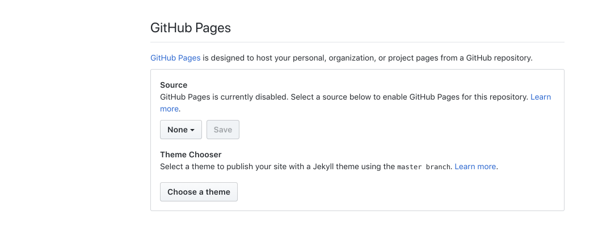
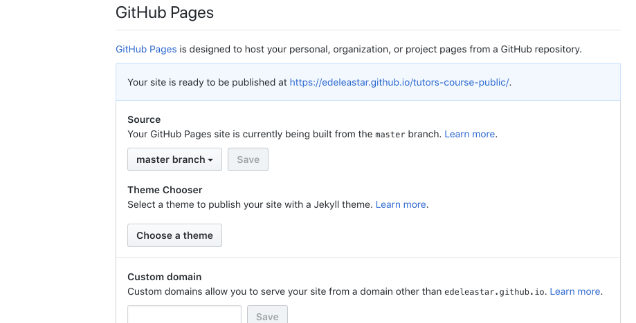
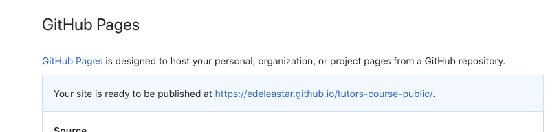

# Serving the course as as a web site

By default the site will not be published as a site yet. Do make it available, you will need to do the following:

- Go to your repo on github.com and select the repository settings:

- Scroll down to the gh-pages section:

- under Source select the Master Branch and press save. 

Your course should now be published - the url is also visible now in the github pages settings:

In general the url will be structured like this:

- https://[YOUR-GITHUB-NAME].github.io/[YOUR-REPO-NAME]

Try the url now and verify that the site is published