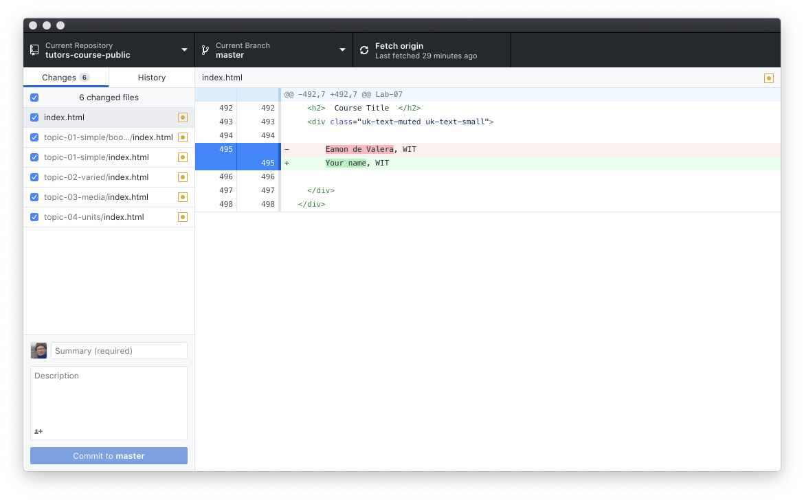
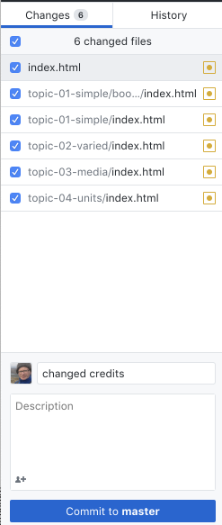

# Updating a site

Once the site is already published the workflow for updating a site is simplified:

- Edit the Course Source
- Regenerate the  (using the tutors-ts command)
- Commit updates to the local repository
- Synchronise the local and remote repositories
- Check if updates published

We can try this now. 

## Edit the Course Source

Make a change to a course you may have been experimenting with - introduce an image or change the wording of a talk or modify the text in a step. If you are using Sublime, make sure to save the file(s). Remember, you are editing the files in `tutors-starter-0`, not `tutors-starter-0/oublic-site-uk`.

## Regenerate the Course

From within the course source folder (tutors-starter-0), run the `tutors-ts` command:

~~~
tutors-ts course web generator: 2.5.0
::   Course Title
  -->   Simple
::  Simple
  -->  Lecture 1
  -->  Lecture 2
  -->  Lab-01
  -->   Varied
::  Varied
  -->  Lecture 3
  -->  Lecture 4
  -->  Lab-02
  -->  Lab-02
  -->  Resource I
  -->  Github Repo  1
  -->  Github Repo  2
  -->   Media
::  Media
  -->  Lecture 5
  -->  Lab-04
  -->  12: Deployment
  -->  Resource I
  -->   Units
::  Units
  -->  Unit 1 Title
:: Unit 1 Title
  -->  Lecture 6
  -->  Lecture 7
  -->  Lab-05
  -->  Unit 2 Title
:: Unit 2 Title
  -->  Lecture 8
  -->  Lecture 9
  -->  Lab-06
  -->  Unit 3 Title
:: Unit 3 Title
  -->  Lecture 10
  -->  Lecture 11
  -->  Lab-07
~~~

## Commit updates to the local repository

Changes made by the above step will be automatically detected by Github Desktop. We commit the changes with a suitable message:

Enter a summary and press `Commit to master`.

## Synchronise the local and remote repositories

The  `Push origin` button will contain an indication that you are out of sync with the server:

Press the button now..

This should quickly update the remote site:

## Check if updates published

Now check if the updates are live:

- https://[YOUR-GITHUB-NAME].github.io/[YOUR-REPO-NAME]

This may take a few minutes for the changes to percolate through the caches etc... Sometimes you can accelerate the process by refreshing your page in the browser while holding the `shift` key down (forces cache clearance for current site).

Only updated files will be pushed - so the `push` should be much quicker than the very first push to this repo.