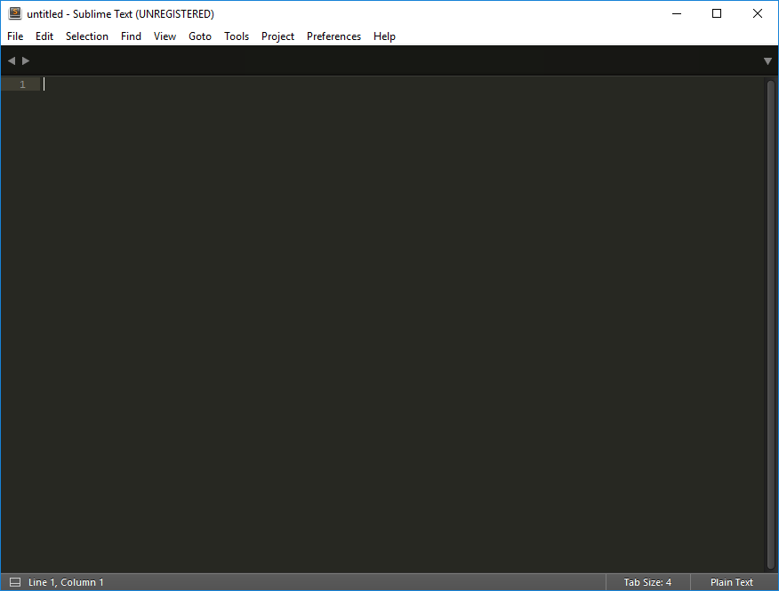
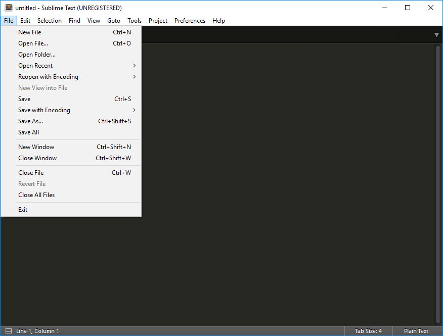
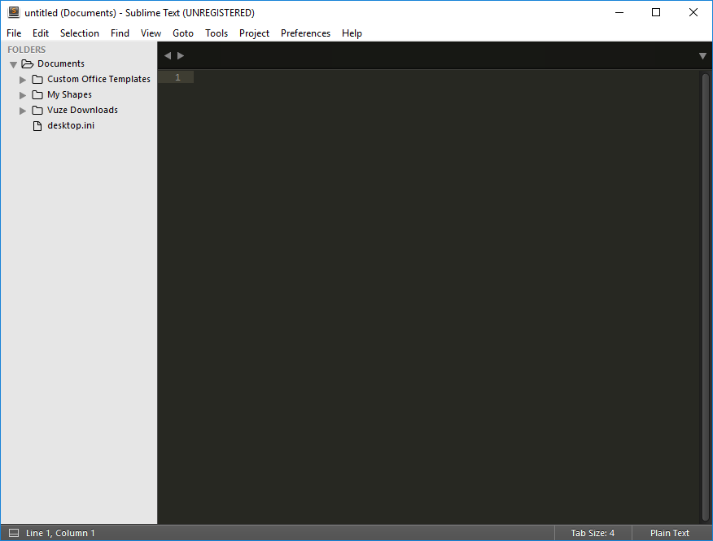

## Sublime

Any plain text editor will do. Sublime is a suitable choice:

- <https://www.sublimetext.com/>

Once installed, Sublime should be an app, launch in the usual way:

It is worth using the 'open folder' feature:

This will keep a tree view of your selected folder on a panel on the left. Having this view open can be very useful when authoring content in tutors.

If you choose [Atom](https://atom.io), it has equivalent [features](https://github.com/atom/tree-view).