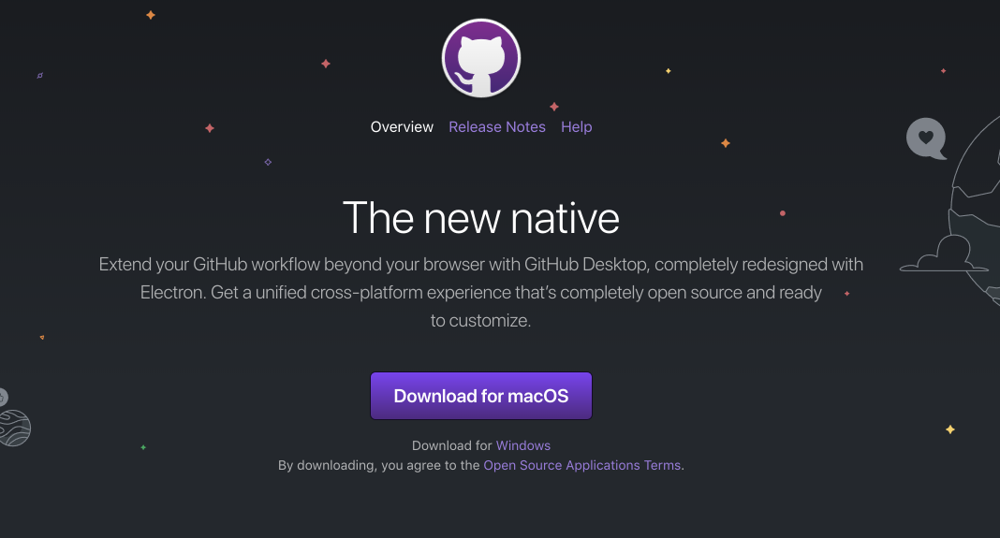

# Git Desktop

If you dont already have a github account, sign up now.

- <https://github.com/join>

Download and install Git Desktop from this site here:

- <https://desktop.github.com/>

Install this app now. 

Once installed, run the app & log in to your github account:

Initially it may not find any local repos - skip this step for the moment:

