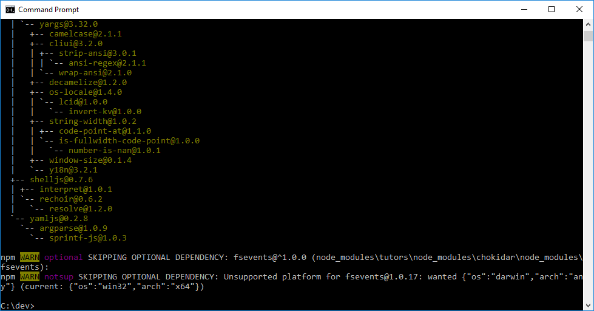

# Install Tutors

With git + node installed, we can install tutors with this command:

~~~
npm install tutors -g
~~~

This should take a minute or two:

Verify the installation be entering the command:

~~~
tutors --version
~~~

Tutors is hosted on github and the npm registry:

- <https://www.npmjs.com/package/tutors>
- <https://github.com/edeleastar/tutor>

There is an install and simple guide there. This course will cover all that is needed to get going.