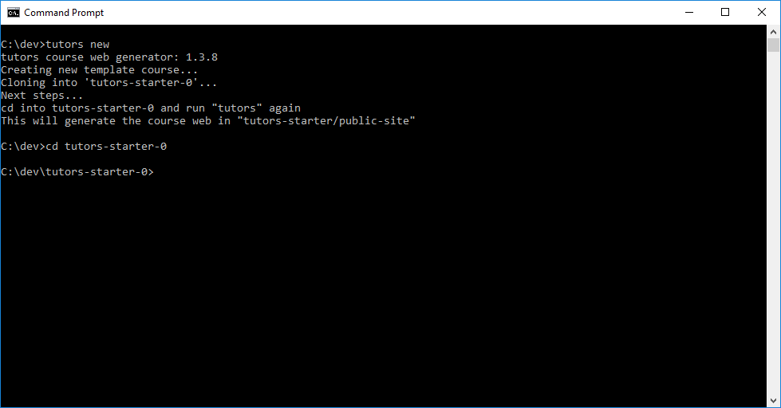
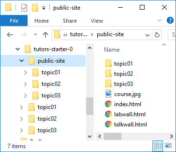
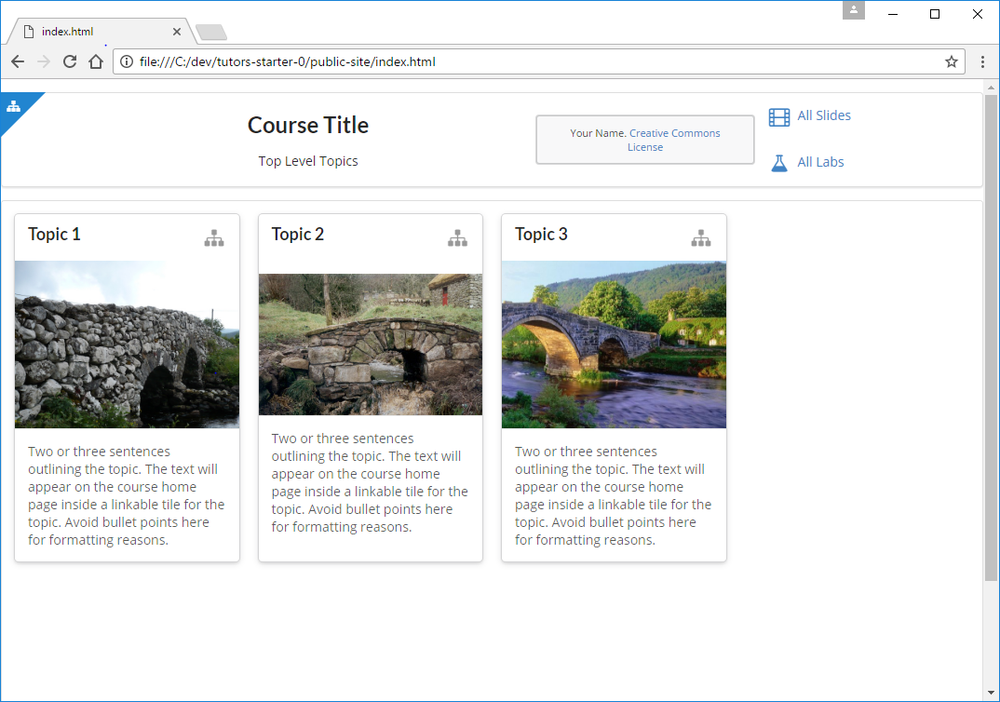

# Generate a Course

The simplest way to get started with tutors is to use the `new` command to generate a template course:

~~~
tutors new
~~~

This should respond with:

~~~
Creating new template course...
Cloning into 'tutors-starter-0'...
Next steps...
cd into tutors-starter-0 and run "tutors" again
This will generate the course web in "tutors-starter/public-site"
~~~

The command will have generated a new folder: `tutors-starter-0`, populated with a sample/template course:

Before looking at the structure of the course in detail - lets "build" the course first and look at the output from a student perspective.

Open a shell, and make sure the current directory is `tutors-starter-0`:

Then enter the `tutors` command:

~~~
tutors
~~~

This will respond with:

~~~
tutors course web generator: 1.3.8
 Topic 1
 Talks:
  -->Lecture I
  -->Lecture II
  -->Resource I
 Labs:
  -->Lab-01
 Topic 2
 Talks:
  -->Lecture III
  -->Lecture IV
  -->Resource II
 Labs:
  -->Lab-02
 Topic 3
 Talks:
  -->Lecture I
  -->Lecture II
  -->Resource III
 Labs:
  -->Lab-03
~~~

Tutors has now generated a complete web site from the course materials. This is populated into a `public-site` folder:

Opening `index.html` in any browser and we see the students view of the course.

