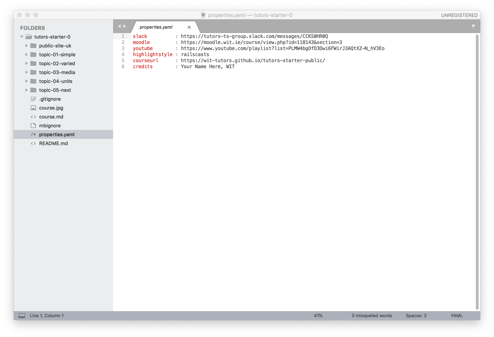
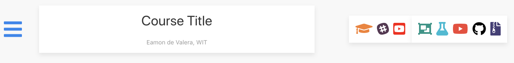

# Exercises

## Exercise 1: Labs

Open one of the labs:

Experiment with the menu bar along the top. The behaviour of the numbers is clear enough - it moves the student through a particular lesson (like this one). Try `left-arrow` and `right-arrow` - they should navigate forward and backward though the steps.

However, the other icons + titles are also navigable. Try them now to see where they lead.

## Exercise 2: Editing the Course Sources

Make sure you can open sublime - and have the complete courseweb open in the side panel (use open->folder to do this):

We can make a small change as an initial experiment. Open the properties.yaml file, and replace 'your name' with your own name, and email or whatever in the `credits` property.

Save the changes, and run the tutors-ts command again. Remember, your tutors-ts command is always run from a shell in the root of the course folder (./tutors-starter-01 in these examples.)

Refresh the browser, and verify that your name has appeared in the header:

