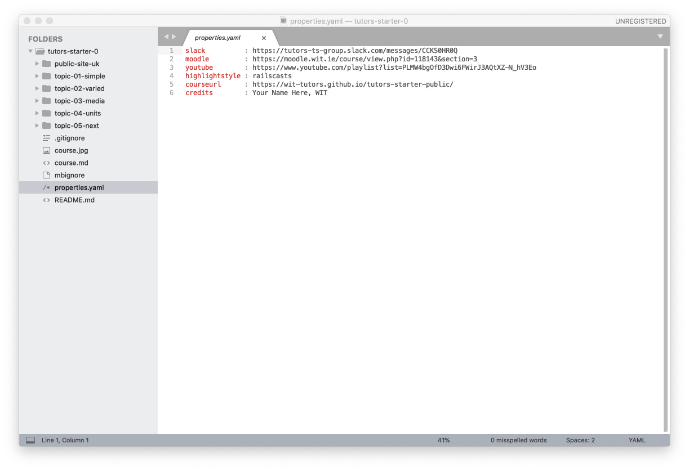
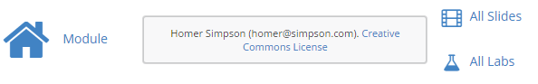
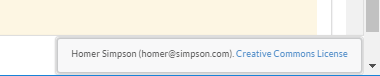
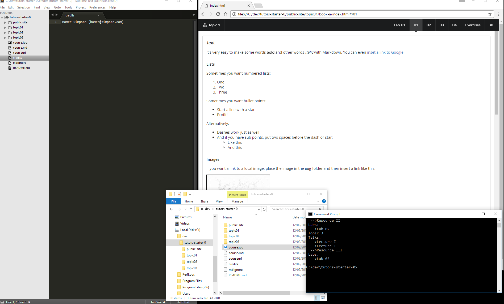

# Exercises

## Exercise 1: Labs

Open one of the labs:

Experiment with the menu bar along the top. The behaviour of the numbers is clear enough - it moves the student through a particular lesson (like this one). Try `left-arrow` and `right-arrow` - they should navigate forward and backward though the steps.

However, the other icons + titles are also navigable. Try them now to see where they lead.

## Exercise 2: Editing the Course Sources

Make sure you can open sublime - and have the complete courseweb open in the side panel (use open->folder to do this):

We can make a small change as an initial experiment. Open the `credits` file, and replace 'your name' with your own name, and email or whatever.

Save the changes, and run the tutors command again. Remember, yhr tutors command is always run from the a shell in the root of the course folder (./tutors-starter-01 in these examples.)

Refresh the browser, and verify that your name has appeared in the header:

and at the foot of each lab:

## Exercise 3: Organising your workspace

When building a course, you often need several applications available concurrently:

- Submlime Text Editor ... to compose the course
- Web Browser ... to see the current generated version of the course web
- Shell ... to regenerate the course when you wish to view the latest version
- File Explorer/Finder ... to rename/reorganise the folders/files as you develop the course.

These could be organised like this -

or any other suitable structure...

To summarise:

- use Sublime to edit the course 'sources' (all files except those in the `public-site` directory).
- use A web browser to review `public-site` directory only
- run the 'tutors' command to periodically regenerated the course as you progress with composition.