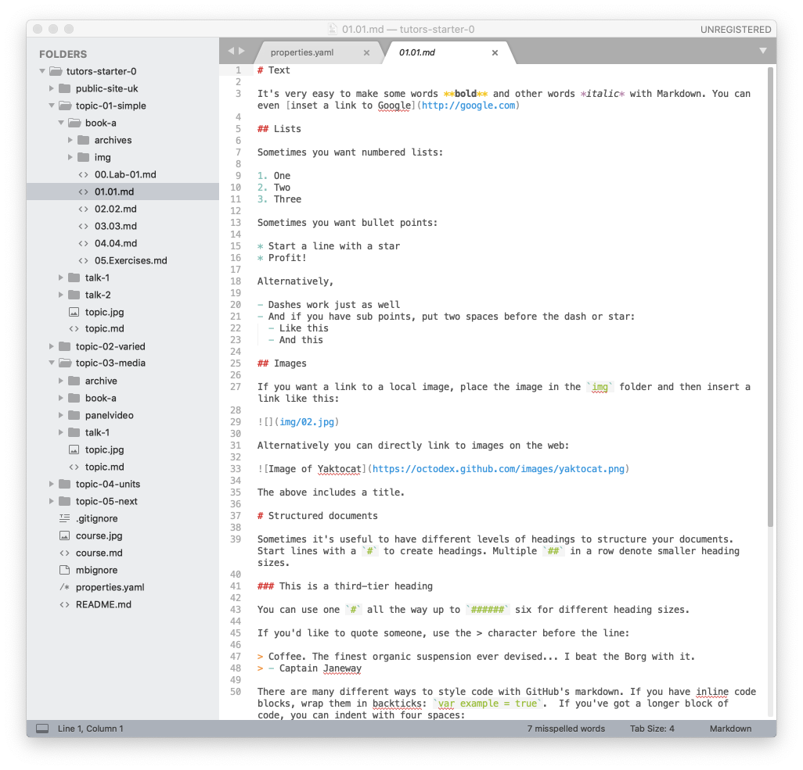

# Text

Markdown is a genera purpose notation for composing web friendly content in simple text. There are only a few rules to learn to equip you for most types if simple web page composition.

Opening the lab we have already generated in sublime:

The lab itself contains a range of Markdown examples - these illustrate the basics of text formating in this notation:

## Bold & Italics

~~~
It's very easy to make some words **bold** and other words *italic* with Markdown. 
You can even [inset a link to Google](http://google.com)
~~~

## Lists

~~~

Sometimes you want numbered lists:

1. One
2. Two
3. Three

Sometimes you want bullet points:

* Start a line with a star
* Profit!

Alternatively,

- Dashes work just as well
- And if you have sub points, put two spaces before the dash or star:
  - Like this
  - And this
~~~

# Headings

Sometimes it's useful to have different levels of headings to structure your documents. Start lines with a `#` to create headings. Multiple `##` in a row denote smaller heading sizes.

~~~
### This is a third-tier heading
~~~

You can use one `#` all the way up to `######` six for different heading sizes.
