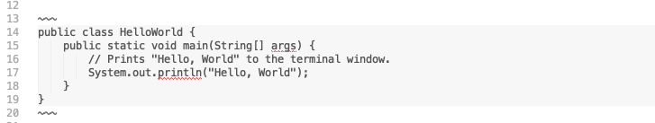

# Code Blocks

One advantage of Markdown - and an associated component rolled into tutors - is code blocks with syntax highlighting. This is implemented more or less automatically, using the this library:

- <https://highlightjs.org/>

To enable it, you surround your code fragment with three tildas : `~~~` :

This should appear like this in your lab:

~~~
public class HelloWorld {
    public static void main(String[] args) {
        // Prints "Hello, World" to the terminal window.
        System.out.println("Hello, World");
    }
}
~~~

A key advantage of this over PDF, for instance, us that the code can be reliably copy/pasted by students into a development environment without any fear of extra formatting information entering the buffers.

Another example:

~~~
<!DOCTYPE html>
<html>
  <head>
    <meta charset="utf-8">
    <title>My test page</title>
  </head>
  <body>
    
This is my page

  </body>
</html>
~~~

Take the above code into your lab, surround with `~~~`. Regenerate the course and verify that it looks like it does above.

Highlight.js recognizes most of the main programming languages.