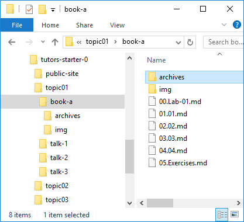

# Archives

If you wish to distribute an archive as part of the lab, then place the archive in the 'archive' folder of the lab:

Then insert a link link this:

~~~
[Solution-01](archives/archive.zip)
~~~

This should render like this:

[Solution-01](archives/archive.zip)

And selecting it download locally.

Create a zip archive now, and try to link to in in one of the steps.
