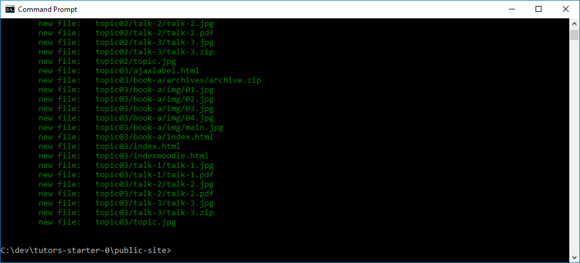

# B: Commit all Files to Local Repository

Commit the files requires we do the following:

1. Make sure we are on the correct `branch`
2. Stage all files
3: Commit all staged files

## 1. Create a gh-pages branch

For a repository to be available publicly on github, the content must be committed to a branch called `gh-pages`

Create such a branch by entering the following command:

~~~
git checkout -b gh-pages
~~~

## 2. Stage all files

So far our repository does not contain any files. It is empty until specifically commit files to it. 

To add all files, use the following:

~~~
git add .
~~~

This will add all files to the current branch (gh-pages)

## 3: Commit all staged files

Before committing the files, we can check which ones are currently staged:

~~~
git status
~~~

If we are happy with this, we can `commit` them now:

~~~
git commit -m "first commit"
~~~

All files are now where we want them: commited to the gh-pages on our local repository. However, they are not published on github yet (next step).

