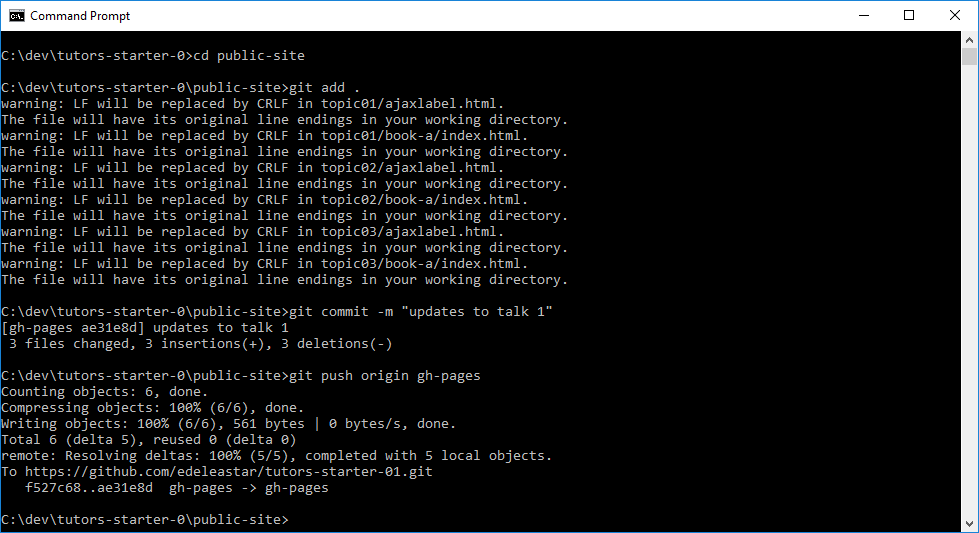

# Updating a site

If a site is already published, then many of the steps covered so far are not necessary. The workflow here becomes:

- regenerate the course (running `tutors` command in the course folder)
- stage and commit any files that have been modified
- push the local to the remote again

We can try this now. 

# 1. Edit the Course Source

Make a change to a course you may have been experimenting with - introduce an image or change the wording of a talk or modify the text in a step. If you are using Sublime, make sure to save the file(s).

## 2: Regenerate the Course

From within the course source folder (tutors-starter-01), run the `tutors` command:

## 3: Commit and Push

From a shell **inside** the public-site folder run the following commands:

~~~
git add .
git commit -m "a description of the update"
git push origin gh-pages
~~~

These commands have the following effects:

- Stage all changed files in the generated course
- Commit the files with a suitable comment
- Push the updated files to the remote (github)

Now check if the updates are live:

- https://[YOUR-GITHUB-NAME].github.io/[YOUR-REPO-NAME]

This may take a few minutes for the changes to percolate through the caches etc... Sometimes you can accelerate the process by refreshing your page in the browser while holding the `shift` key down (forces cache clearance for current site).

Only updated files will be pushed - so the `push` should be much quicker than the very first push to this repo.