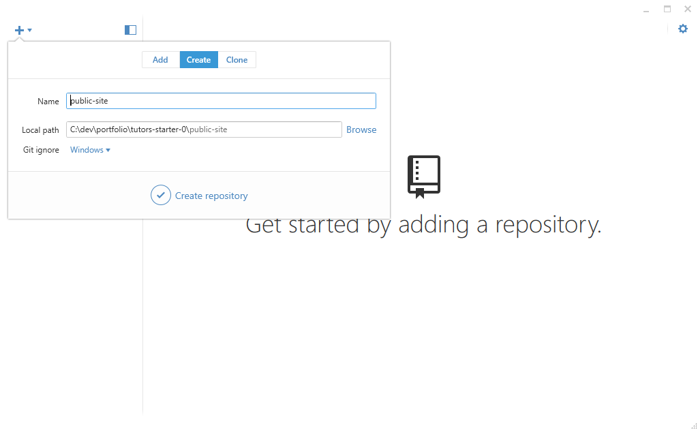
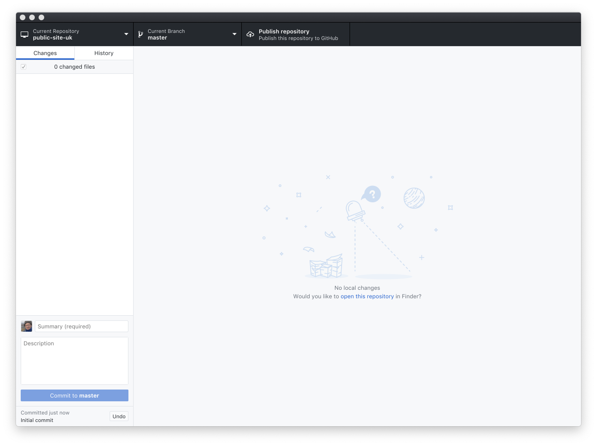
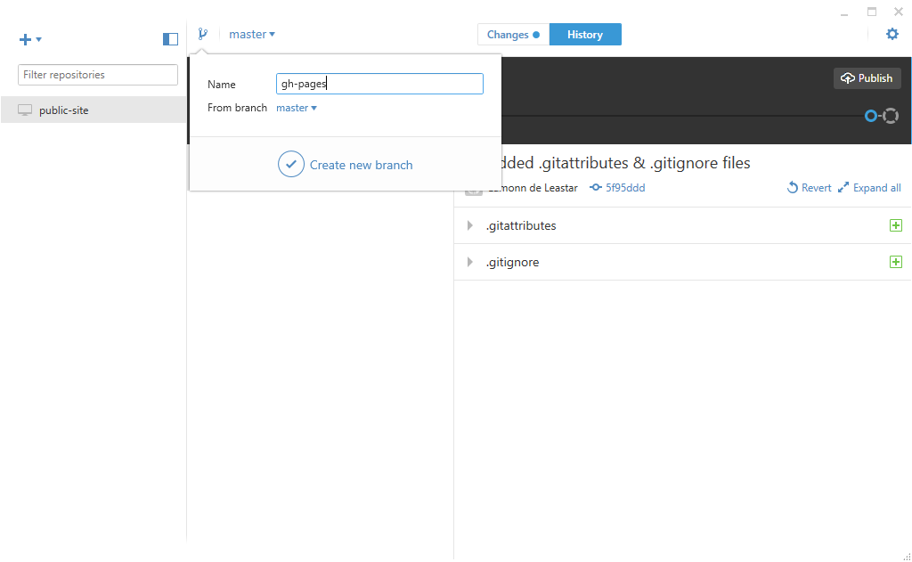
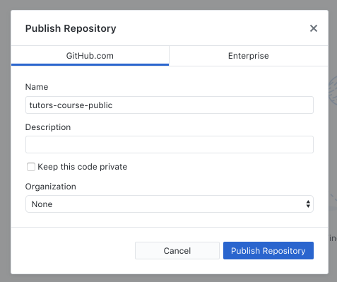
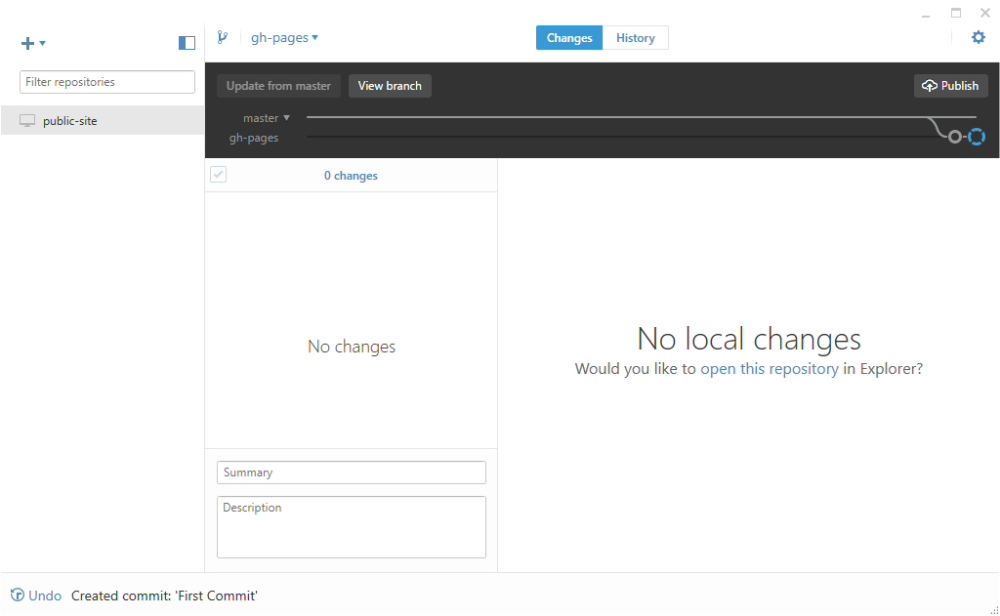

# Create a Repository

Open the Git Desktop app, and drag & drop the `public-site` folder onto the app:

Press `Create Repository`

The app will look like this:

Select the `Branch` button (next to 'master' on the toolbar), enter `gh-pages` and press `Create new branch`

In the next view - enter a comment in the box shown below, and press `Commit to gh-pages`:

All files are not committed - on the correct branch:

