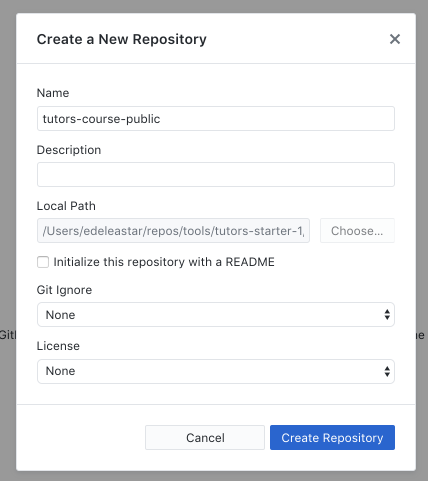

# Create a Repository

Open the Git Desktop app, and drag & drop the `public-site` folder onto the app:

When it lands on the app it will prompt you to create  new repository. Press `Create Repository`

The app will initiuaize  new git repository in the public-site fodler. It should look like this:

Select the `Branch` button (next to 'master' on the toolbar), enter `gh-pages` and press `Create new branch`

In the next view - enter a comment in the box shown below, and press `Commit to gh-pages`:

All files are not committed - on the correct branch:

These files are still only on your local workstation, however. The next step is to publish these files on the web via github.
