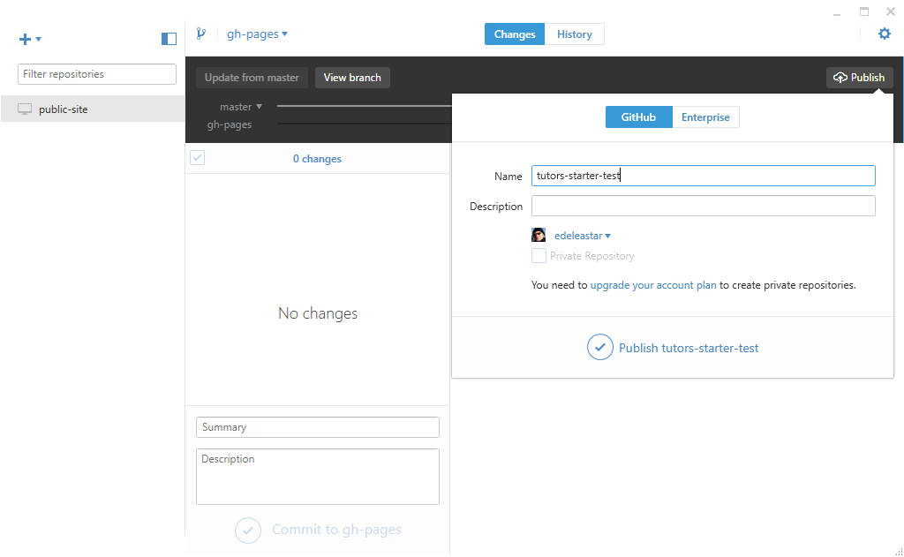
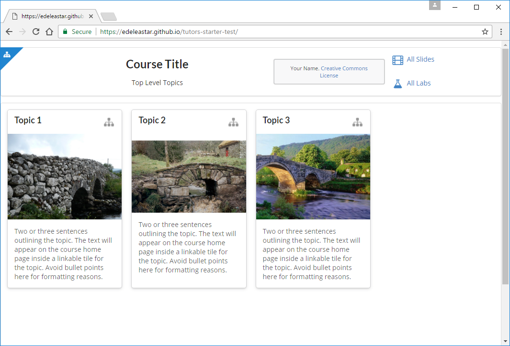

# Publishing to Githib

To get the site to github - press the `Publish` button:

As this is the first attempt at publishing, we will be prompted for a github hosted repository. Chose a suitable name here and press `Publish...`

Within a few moments the site should be 'synced' - and we should be able to browse the site 

The url will be something like:

- https://[YOUR-GITHUB-NAME].github.io/[YOUR-REPO-NAME]

Verify that yours is published now.

