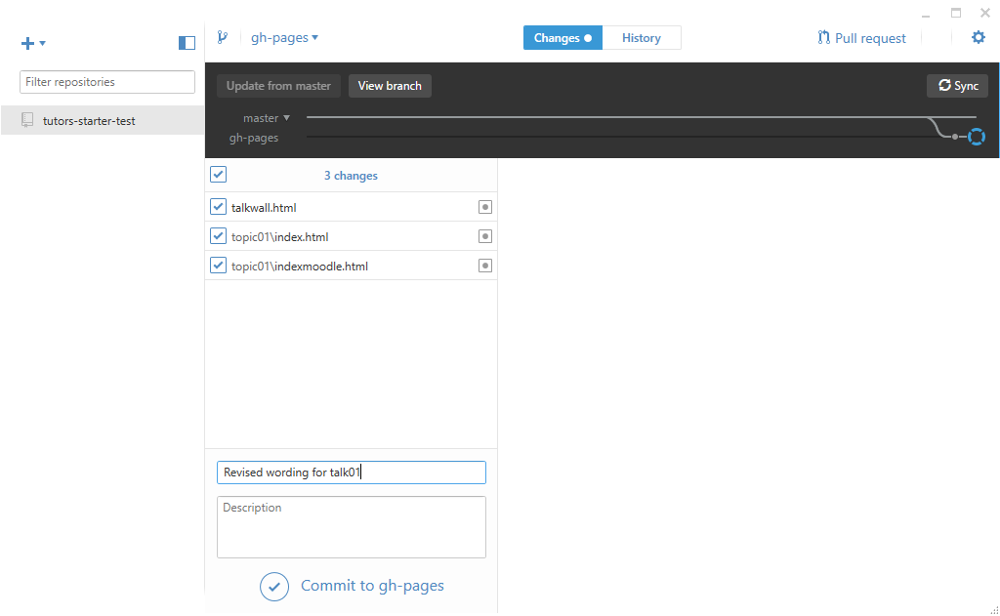
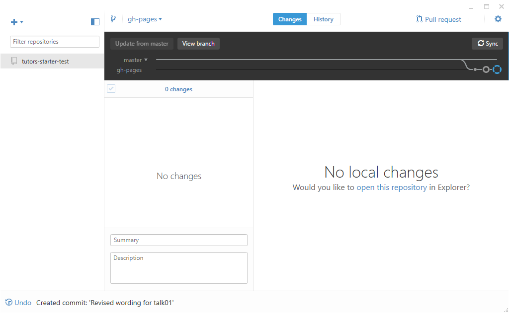
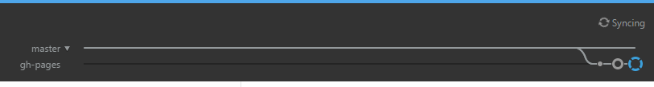
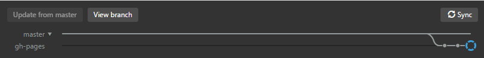

# Updating a site

Onec the site is already published the workflow for updating a site is simplified:

- Edit the Course Source
- Regenerate the Course
- Commit updates to the local repository
- Synchronise the local and remote repositories
- Check if updates published

We can try this now. 

## Edit the Course Source

Make a change to a course you may have been experimenting with - introduce an image or change the wording of a talk or modify the text in a step. If you are using Sublime, make sure to save the file(s).

## Regenerate the Course

From within the course source folder (tutors-starter-01), run the `tutors` command:

## Commit updates to the local repository

Changes made by the above step will be automatically detected by Githib Deskop. We commit the changes with a suitable message:

## Synchronise the local and remote repositories

Press `Sync`:

This should quickly update the remote site:

## Check if updates published

Now check if the updates are live:

- https://[YOUR-GITHUB-NAME].github.io/[YOUR-REPO-NAME]

This may take a few minutes for the changes to percolate through the caches etc... Sometimes you can accelerate the process by refreshing your page in the browser while holding the `shift` key down (forces cache clearance for current site).

Only updated files will be pushed - so the `push` should be much quicker than the very first push to this repo.