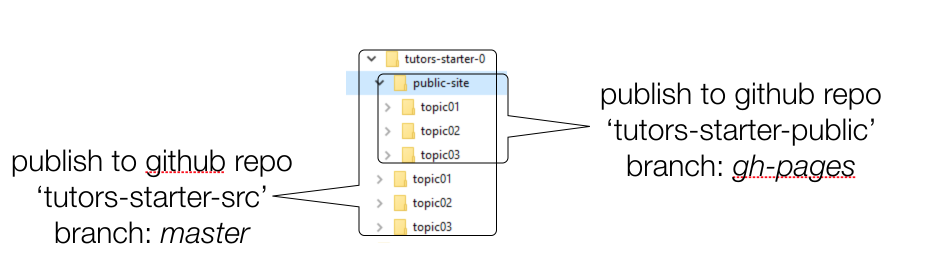

# Exercises

## Exercise 1: Practice Updating & Publishing the Public Site

Try another edit to the source of the course to get used to the process. Remember, it will involve the following:

- Make the change to the source
- Regenerate the course (running `tutors` command in the course folder)
- Inspect the course locally first (opening public-site/index.html) to see if the changes are as expected
- Commit auto detected modifications in Github Desktop
- Sync the repository

## Exercise 2: Publish the Source to github

Currently github hosts the public-site contents only - and we are using the gh-pages facility to have the contents served as a web site. We could try creating another repo on github - this time to host the source of the course. I.e. the `tutors-starter-0` contents.

Before you do this, however, there is one important step  

- **delete the .git directory in tutors-starter-0 folder**. 

This is important - as the starter course was cloned from a git repository - and is currently linked to this origin. Once this the `.git` folder is deleted, we are breaking this link.

You can use the same steps we used to create the public site repo to create a separate repo for the course sources:

- drag and drop `tutors-starter-0` onto the Github desktop app (see below for potential error that can occur here)
- press create a new repo
- commit all files to the local repo - this time stay with the `master` branch
- publish the repo to github

 A bug in Github Desktop may cause an error to be reported in the `drag & drop` step. If this occurs, terminate Github Desktop, restart it and try drag & drop again. It should work the second time. In the git labs later in workshop we cover a better technique for initialising repositories.

The source repo contains a file called `.gitignore` - which contains the following:

~~~
public-site
private-site
standalone-site
~~~

This excludes these subdirectories from the repo - which we are happy to do. This is the structure we can aim for:

in our `source` repo, we can use the master branch.

Check the github web site on your account to see that you now have 2 separate repositories.