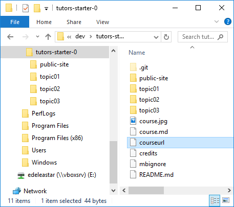

# Publishing to Moodle

Now that we have the site live - we may choose to keep Moodle as the primary gateway to our course. I.e. we would like to import the github hosted site into moodle - rather than replicating the material there. 

To get ready for the import, we need to make one small change to our source. In the source folder, there is a file called `courseurl`. 

## courseurl

This is the default contents:

~~~
http://yourgithubname.github.io/course-title
~~~

Edit this, and replace with the actual url of your deployed course

~~~
http://[YOUR-GITHUB-NAME].github.io/[YOUR-REPO-NAME]
~~~

For instance:

~~~
http://edeleastar.github.io/tutors-starter-01
~~~

Note that the protocol in the above is `http` not `https`. This is important.

Regenerate the course via the tutors command, then commit and publish the revised course. Here are the commands to do this (starting from within the course source folder):

~~~
tutors
cd public-site
git add .
git commit -m "a description of the update"
git push origin gh-pages
~~~

