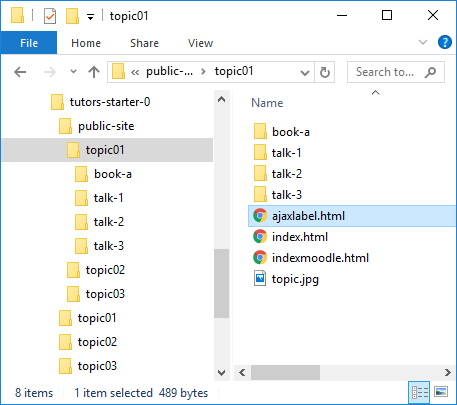

# ajaxlabel.html

For each topic in the `public-site` folder, tutors will have generated a file called `ajaxlabel.html`:

There is one of these files for each topic.

The contents of this file will establish the link from a moodle topic to a github hosted site:

## Example ajaxlabel.html

~~~

  

    

      <iframe id="output" style="width: 100%;" frameborder="0" height="1200">
      </iframe>
    

  

~~~

There is no need to understand/edit or work with this file - we can use it exactly as is. However, please note that each topic has its own slightly different version - so you will need each of these in the procedures that follow.

And the procedure is:

1. Create Empty Topic in Moodle
2. Add a Label to the Topic
3. Copy `Ajaxlabel.html` into the label

This is illustrated in the next step...
