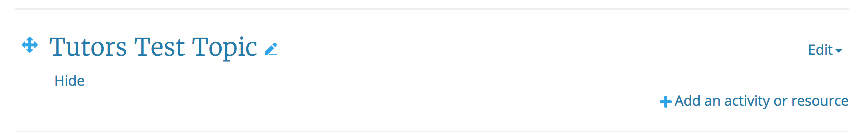
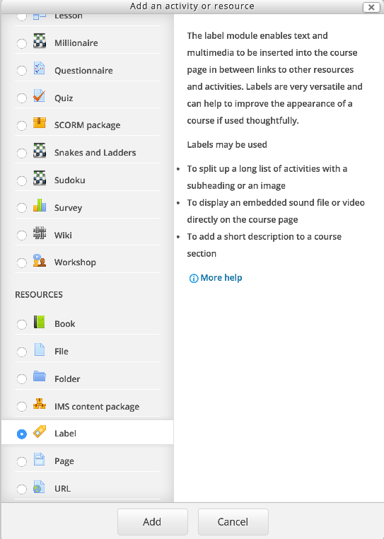
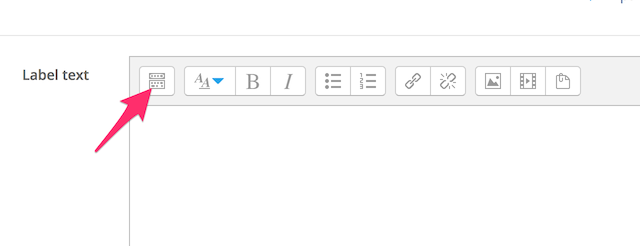
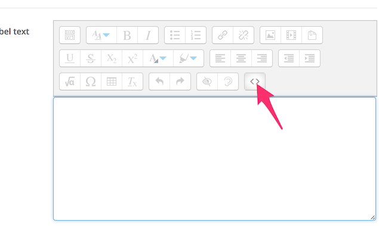
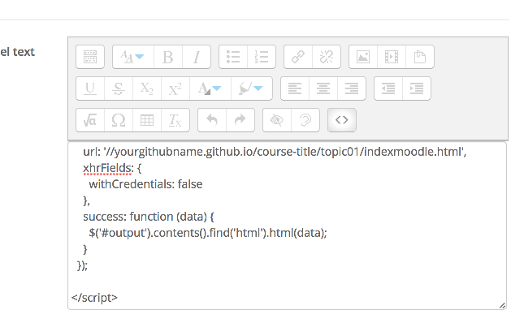
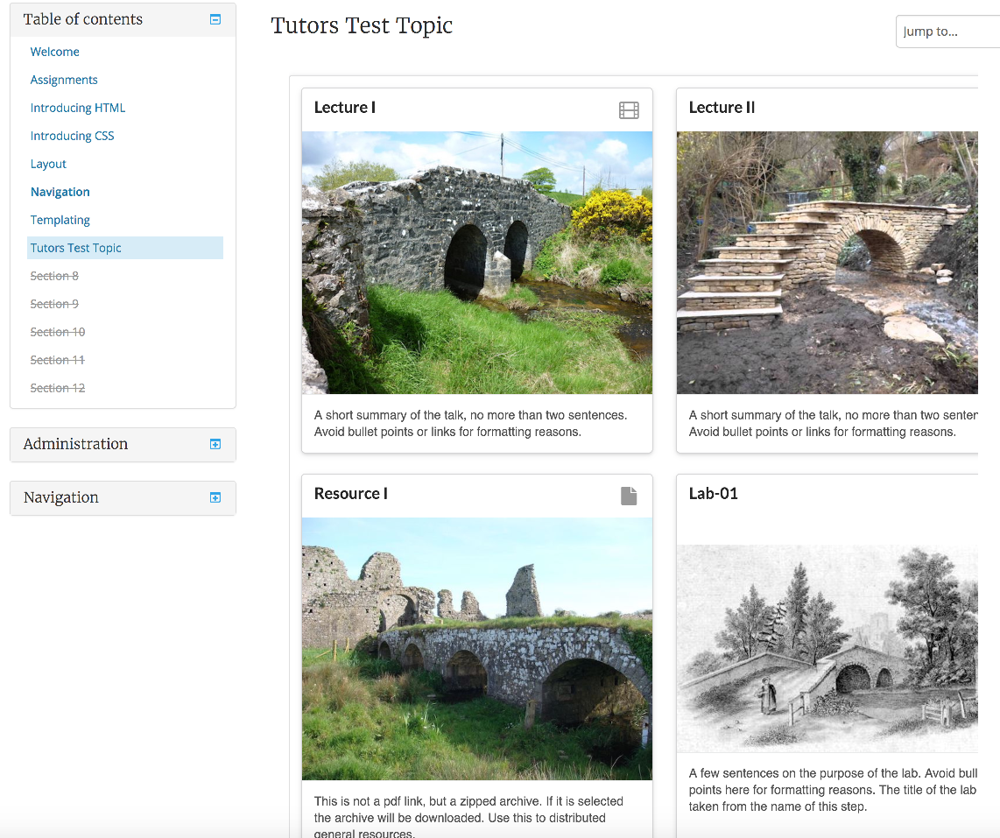

# Publishing to Moodle

## 1. Create Empty Topic in Moodle

For any existing or new moodle course, create an empty topic:

## 2. Add a Label to this Topic

Switch to edit mode, and add a new `label` to the topic:

## 3: Copy/paste the contents of `ajaxlabel.html` into the label

This step will require you to edit the label, and change the editing mode.

When editing, first reveal additional toolbar options:

And now switch to `HTML Source` view by pressing the `<>` icon:

Now, copy/paste the entire contents of the selected `ajaxlabel.html` files directly into the label:

Press save - and switch back to normal (non editing) mode. The topic hosted on github should be visible. The content will not be visible until you switch (from edit mode).

This is a one-off step, establishing a binding between the moodle topic and the topic as hosted on github. Any updates to the github content will be automatically rendered in moodle. I.e. you do not need to revisit this step if you make changes to your content.

