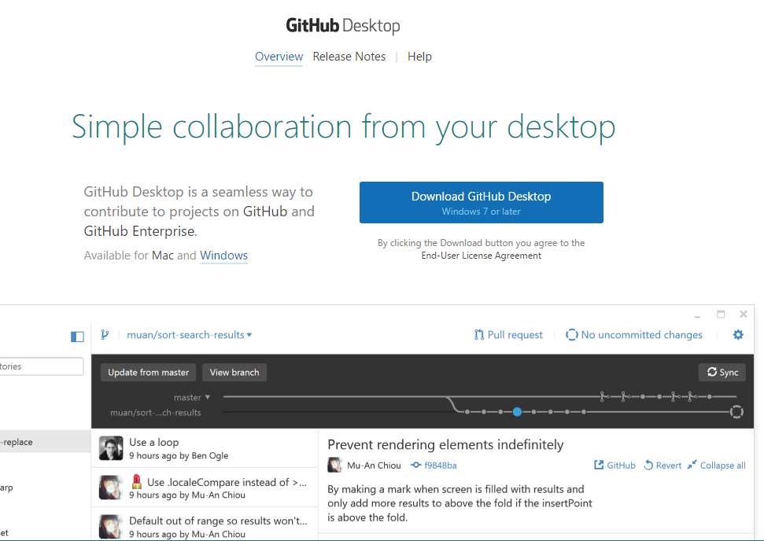
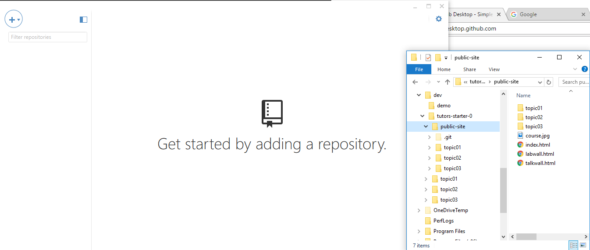
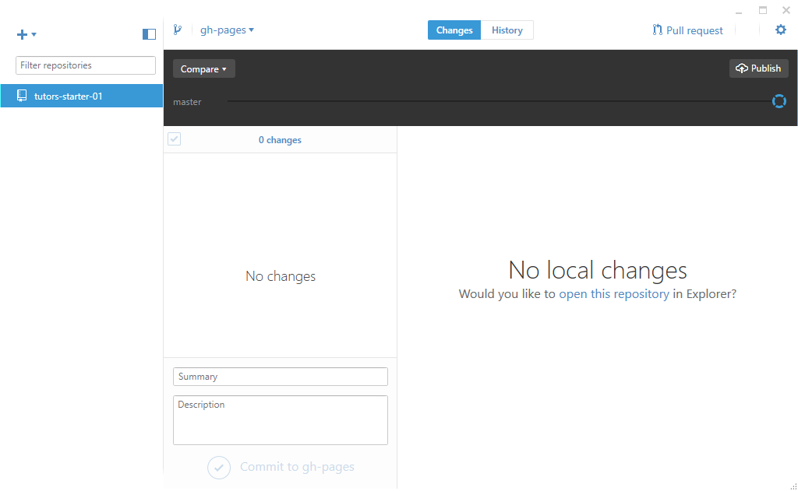

# Visual Git

If you find using the command line tedious - there is a large range of Visual clients for git:

- <https://git-scm.com/downloads/guis>

Try this one:

- <https://desktop.github.com/>

Install this app now. 

Once installed, run the app & log in to your github account:

Initially it may not find any local repos - skip this step for the moment:

Now we can add the repository in `public-site` to the app. The most effecient way of doing this is the Drag & Drop the `public-site` folder directly into the app: 

This should recognize the repo - and give you a convenient control panel:

In the next step we will publish a new version of the courseweb using this tool instead of the command line.

