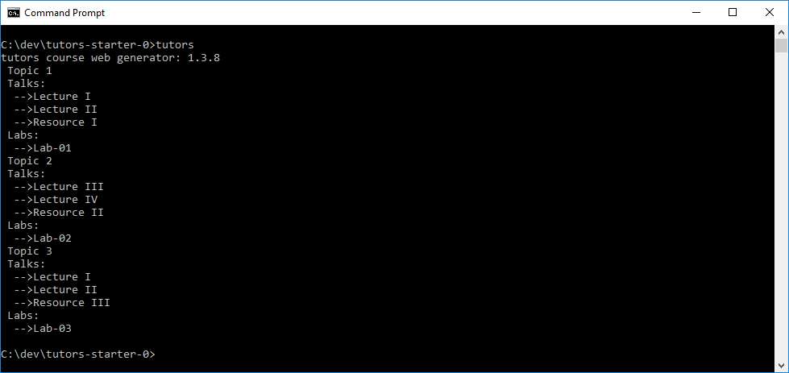
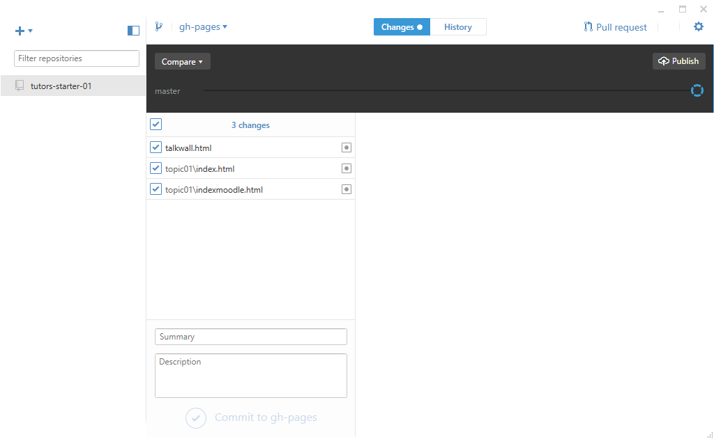
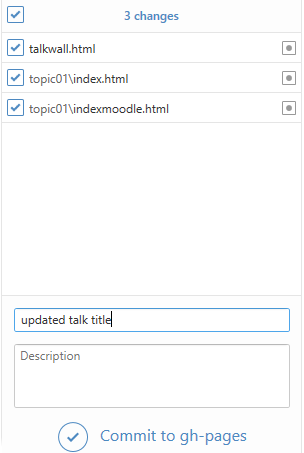
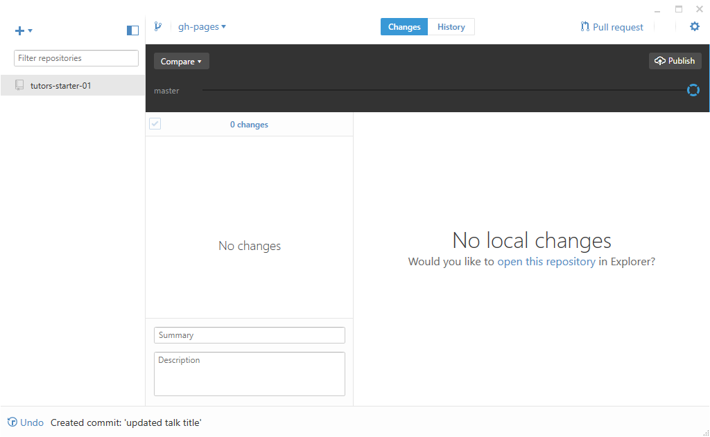
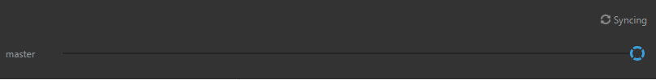

# Publishing Using Visual Git

Make another change to the course source - a new step or a modified talk title. 

Regenerate the course with the tutors command:

Depending on what changes you have made, they should be summarised in Visual Git:

When we enter a Summary - then we can commit the changes:

Once committed - the panel is reset:

Now we can publish:

... which will 'sync' the changes to github:

Once synced - the public site should be updated and the status reset:

The above Gui interaction replaces these commands:

~~~
cd public-site
git add .
git commit -m "a description of the update"
git push origin gh-pages
~~~

It may generally more convenient to use a visual client with tutors. It does not, however, replace the `tutors` command however, which will need to be run before each attempt to `sync`.
