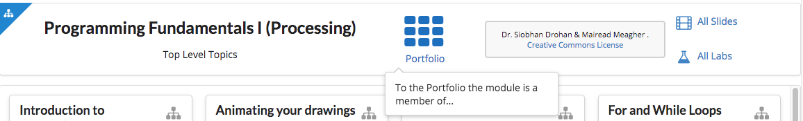
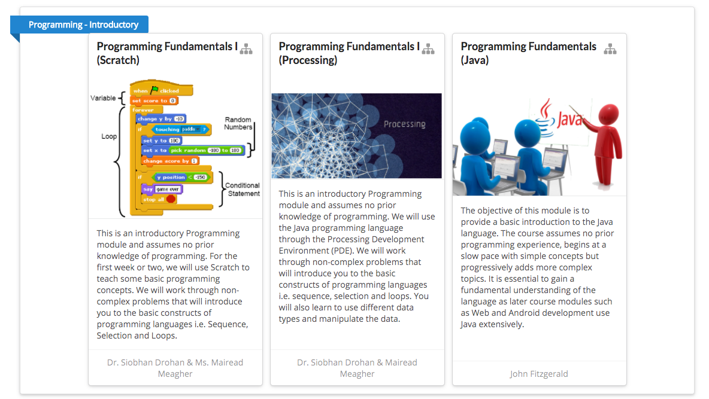
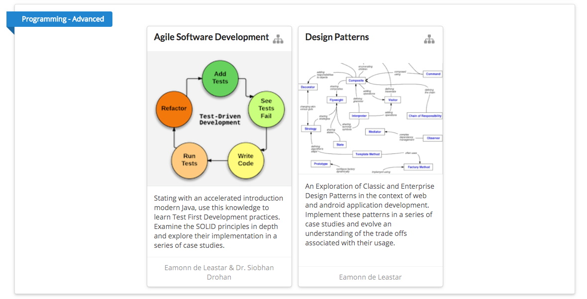
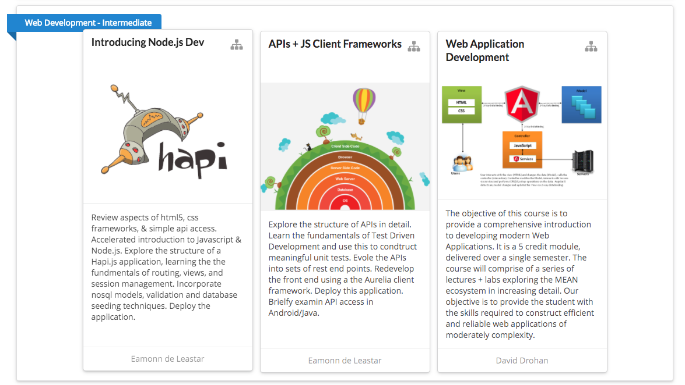

# Portfolio Example

Visit this site here:

- <https://edeleastar.github.io/>

This is a `portfolio` of modules built with tutors. Each card in the above is a full module. Each module is navigable as before, except each course 'home' page has a slightly different header:

This will permit navigation back to the Portfolio 'home'.

Notice also that, in the Portfolio Home, modules are grouped and labeled:

## Group 1

## Group 2

## Group 3

