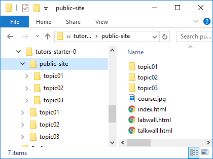

# Github Gh-pages

For this lab, create a new tutors course separate from the earlier experiments.

Recall that tutors generates a static web site to the `./public-site` folder:

This folder is what we need to publish - not the 'source' for the course web. 

Mastering git command line can take quite some time - and require considerable practice. For the moment. we will cover just enough commands to get the course web live, and also to update it. 

To publish a new course web for the first time would require these steps: 

##A: Create the Repositories

This requires 2 repos to be created - a local (on your workstation) and a remote (on github). Once created, the local must be associated with the remote.

## B: Commit all relevant files to the local repo

This is a two stage process, adding the files (sometimes called staging), and then committing them once added

## C: Push the local repo to the remote

This step will make the repository available publicly. This could involve a substantial transfer if a complete course is being published. However, for minor updates to an already published course, this step will only push updates.

# ...

The next steps go through this in detail...