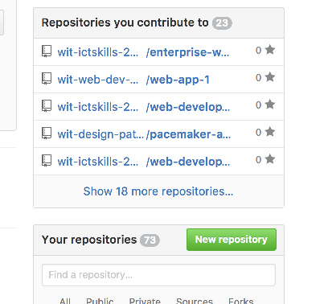

# A: Create Repositories

Creating a new repo requires the following steps:

1. Create a new repository on github, sometimes called the `origin` in git terminology 
2. Create a local git repo in the `public-site` folder
3. Associate the local repo with the remote repo
3. Create a `branch` called `gh-pages`

## 1. Create Remote Repository

Visit:

- <http://github.com>

and log in / sign up.

Locate the `New Repository` button:

And create a new repo:

Once you press 'Create Repository` you will see this view:

Make a copy of the URL you see here in the Quick Setup panel - make sure to have 'https' selected before copying the url.

## 2. Create Local Repository

Back in the shell, and from **inside** the `public-site` folder, enter the following command:

~~~
git init
~~~

This will create a local repository in the public-site folder. 

## 3. Associate the local repo with the remote repo

You may have the url for the github repo you created above. It should be something like this:

~~~
https://github.com/[YOUT-GITHUB-NAME]/tutors-starter-01.git
~~~

We use this url to establish the link from the local to the remote repo via this command:

~~~
git remote add origin [THE-FULL-URL-OF-YOUR-REPO]
~~~

They should now be linked. We can verify this with the following command:

~~~
git remote -v
~~~

